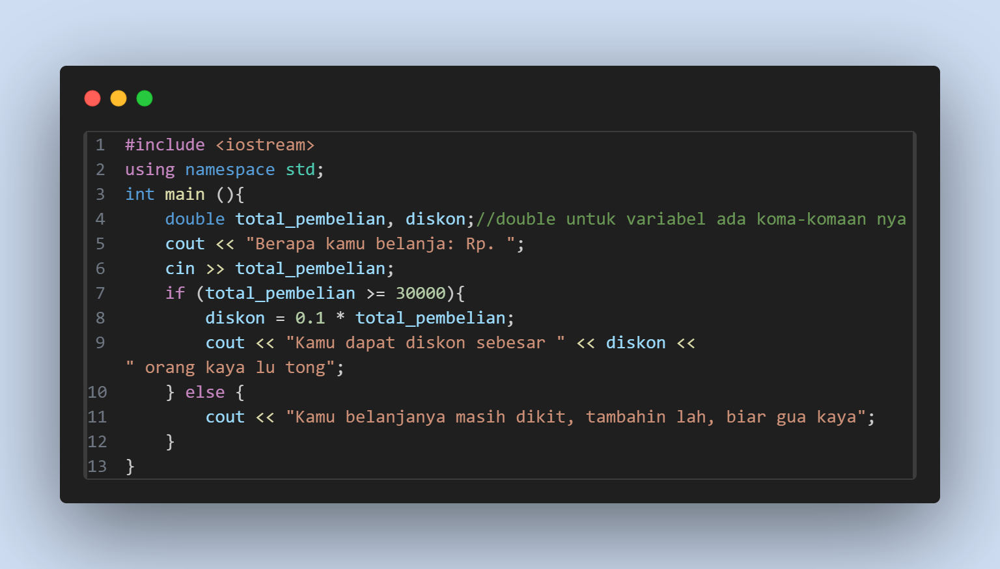

# <h1 align="center">Laporan Praktikum Modul 1</h1>

Dimas Ramadhani

103112400065

## Tujuan Praktikum
1. Mengulas Kembali dasar-dasar algoritma dari yang telah dipelajari pada semester 1 dan 2
2. Melatih problem solving dalam menyelesaikan masalah 
3. Mempelajari dasar-dasar dari bahasa C++

## Dasar Teori
C++ merupakan peningkatan fitur dan pengoperasian dalam perkodean dari bahasa C. peningkatan ini ditandai dengan ++, tanda tersebut merupakan bentuk pertambahan nilai dari suatu variabel pada bahasa C.
C++ Adalah bahasa yang menggunakan pemrograman berorientasi objek (OOP). Object Oriented Programming atau disingkat OOP merupakan model pemrograman yang menggunakan objek untuk pengembangan perangkat lunak yang meliputi kelas, objek, metode dan atribut.
Karena C++ menggunakan pemrograman berorientasi objek, C++ dapat digunakan dalam pengembangan perangkat lunak, pengembangan game, web browser dan banyak bidang lainnya.
## Guided

### 1. Guided 1
#### Perbelanjaan

## Unguided

## Kesimpulan

## Referensi
https://www.revou.co/id/kosakata/bahasa-cpp
https://www.petanikode.com/cpp-untuk-pemula/#:~:text=Apa%20itu%20C++?,yang%20dibuat%20oleh%20Bjarne%20Stroustrup%20.&text=Seperti%20namanya%2C%20Simbol%20%E2%80%9C%20++%20%E2%80%9D,Mengapa%20bisa%20begitu?
https://www.techtarget.com/searchapparchitecture/definition/object-oriented-programming-OOP
https://www.gamelab.id/news/2677-bahasa-pemrograman-c-sejarah-fitur-kelebihan-dan-pengembangannya-dalam-industri#:~:text=C++%20digunakan%20secara%20luas%20dalam,lunak%20grafis%2C%20dan%20aplikasi%20desktop.