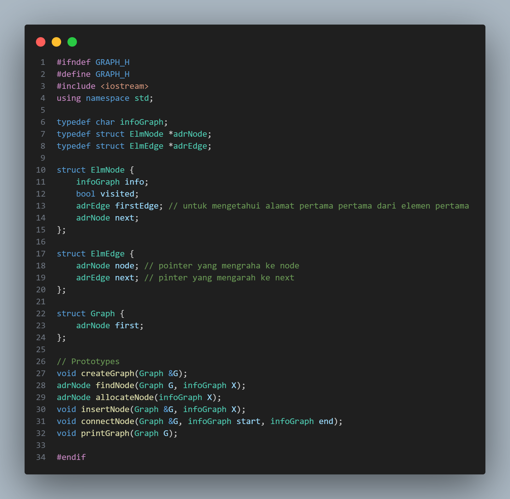
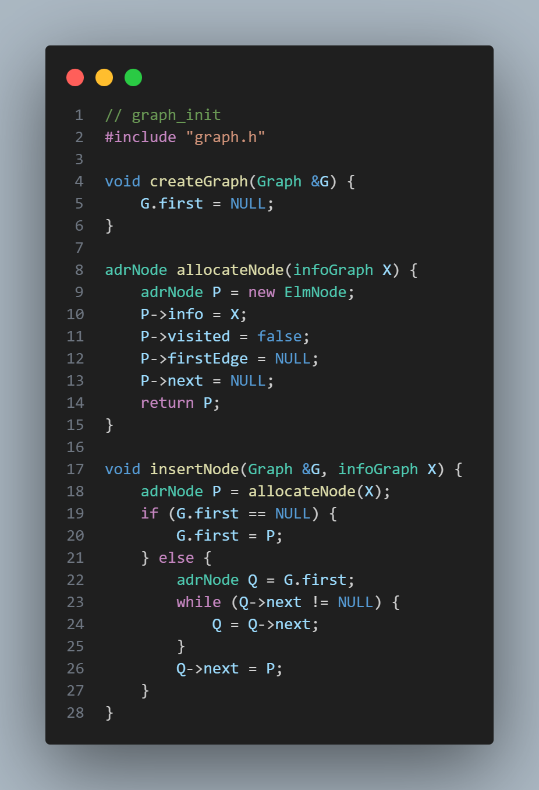
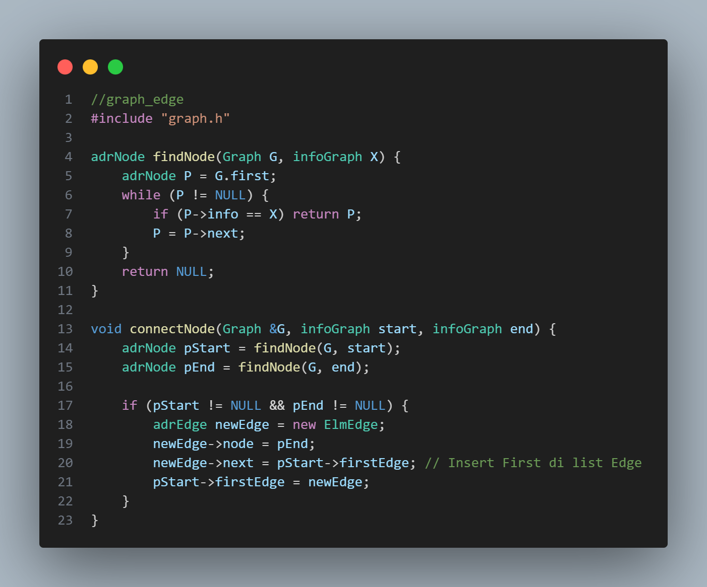

# <h1 align="center">Laporan Praktikum Modul 14</h1>

Dimas Ramadhani

103112400065

---

## Tujuan Praktikum
1. Praktikan paham dengan konsep dasar struktur data Graph.
2. Praktikan mampu mengimplementasikan dalam pembuatan program menggunakan Graph.
3. Praktikan dapat melatih kemampuan dalam menyelesaikan masalah yang menggunakan Multi Linked Graph.

---

## Dasar Teori
### Pengertian Graph
Graph dalam pemrograman terdiri dari dua hal yaitu vertex `(Node)` dan simpul `(Edges)`. `Vertex` merupakan sebuah node yang menyimpan beberapa informasi seperti data yang disimpan, pointer next, pointer yang menunjuk edges, dan value terkunjungi. `Edges` merupakan sebuah node yang berfungsi untuk menghubungkan satu simpul dengan simpul lainnya.

Contohnya seperti sebuah rumah dan sekolah digambarkan menjadi `vertex`, untuk menghubungkan kedua tempat itu dibutuhkan jalan atau `Edges`.

### Jenis Graph
Graph memiliki beberapa jenisnya seperti:
1. Graph Berarah **(Directed Graph)**, merupakan graph pada setiap node memiliki edges yang ada arahnya menujuk node atau simpul lain.

2. Graph Tak-Berarah **(Undirected)**, setiap node setiap node yang dihubungkan oleh edges tanpa arah. Misalkan node a dihubungkan node b, maka node a dapat mengarah ke node b dan sebaliknya.

3. Graph berbobot **(Weighted Graph)**, Setiap edges nya memiliki bobot atau nilai yang menggambarkan jarak, nilai, biaya, kapasitas dan lain-lain. Contoh seperti pemodelan jaringan dan rute jalan.

4. Ketetanggaan **(Adjacency/neighbor)**, Dua simpul disebut bertetangga bila dihubungkan langsung oleh sebuah sisi. Konsep ini penting untuk penelusuran dan optimasi lintasan. 

### ADT Graph
Struktur graph memiliki beberapa bagian, untuk simpul dapat dinamakan dengan `ElmNode`dan `ElmEdge`. `ElmNode` berupa struktur yang isinya info yang dibawa, penanda visited untuk mengetahui apakah sudah dikunjungi atau belum, pointer untuk  menunjuk sisi atau `edges` pertama, dan pointer lagi untuk menunjuk node atau simpul selanjutnya. `ElmEdge` menyimpan bebrapa data seperti pointer yang menunjuk node tujuan dan pointer edge berikutnya. Untuk struktur dari graph nya sendiri memiliki pointer first yang menunjuk node pertama. 

Untuk fungsi-fungsi dasarnya seperti:
- **`CreateGraph`**, biasanya pada saat baru memulai program harus pembuatan graph terlebih dahulu dengan memberikan first itu adalah NULL.
- **`InsertNode`**, berfungsi untuk memasukkan node ke list graph.
- **`DeleteNode`**, berfungsi untuk menghapus node dari list graph.
- **`ConnectNode`**, berfungsi untuk menghubungkan satu node ke node lainnya.
- **`DisconnectNode`**, kebalikan dari `ConnectNode` yaitu memutuskan node dari node lainnya.
- **`FindNode`**, mencari node dari list Graph biasanya berdasarkan info yang diberikan.
- **`FindEdge`**, mencari edge
- **`PrintInfoGraph`**, mencetak seluruh info dari graph. Contohnya mencetak node apa saja yang terhubung dari suatu node.
- **`PrintTopologiGraph`**, mencetak seluruh node namun berdasarkan derajat tertinggi (edges paling banyak).

### Metode Penelusuran Graph
1. Breadth-First Search **(BFS)**
Pencarian dilakukan dengan menelusuri sekitar dari node yang ditunjuk sebagai node pertama. Atau dapat dikatakan penelusuran node sekitar terlebih dahulu. 

2. Depth-First Search **(DFS)**
Pencarian ini konsepnya menetapkan suatu node untuk dijadikan titik awal. Lalu ia akan menelusuri cabang dari node sampai akhir jika sudah sampai akhir maka akan backtrack (akan menelusuri node cabang lainnya).

---

## Guided
### 1. Guided_Graph

#### Code C++ Main

#### Header C++ Graph

#### Code C++ Graph init

#### code C++ Graph edge

#### code C++ Graph Print

**Penjelasan**
Alur program ini dapat dilihat dari kode pada file `main.cpp`. Pertama membuat list dari graph nya menggunakan fungsi **`createGraph(G)`** dimana variabel `G` adalah list dari graph nya. Pada fungsi `createGraph` melakukan inisialisasi first nya `NULL` atau kosong, ini artinya list graph sudah dibuat.

Kedua program membuat atau memasukkan data ke list graph menggunakan fungsi **`insertNode(G, A)`** dimana `G` merupakan list dari graph dan `A` merupakan data bertipe character. Pada fungsi ini, program membuat variabel baru sementara yang menyimpan alamat dari fungsi **`allocateNode(X)`**. Fungsi **`allocateNode(X)`** berguna untuk membuat atau mengalokasi node baru dengan memasukkan data `X`. Setelah menyimpan alamat dari fungsi tersebut, jika `first` pada list kosong yang artinya belum ada node apapun maka kita jadikan variabel baru tadi menjadi `first`. Selain itu akan mengalokasikan variabel baru tadi ke urutan terakhir pada list graph. Sebenarnya pada fungsi `insertNode` itu hanya membuat dan me-list node apa saja yang sudah dibuat untuk diimplementasikan kebentuk graph.

Ketiga program akan menghubungkan satu node dengan node lainnya menggunakan fungsi **`connectNode(G, A, B)`** dimana `G` merupakan list graph, `A` merupakan Node awal, dan `B` merupakan node target dari `A`. Pada program ini akan mencari alamat dari `A` dan `B` menggunakan fungsi **`findNode(G, target)`**. Jika salah satu adalah null maka program tidak melakukan apapun, selain itu program akan membuat `edge` atau simpul baru dimana `node` yang ditunjuk adalah `B`, lalu `next` adalah `firstEdge` pada `A` lalu `firstEdge` pada `A` sekarang adalah `edge` yang baru saja dibuat.

Lalu program akan mencetak semua tetangga dari node yang ada dalam graph menggunakan **`printGraph(G)`** dimana `G` adalah list graph. Fungsi ini membuat variabel sementara yang menyimpan `node first` pada list graph. Ketika variabel sementara tadi tidak kosong atau `NULL`, program akan mencetak Node sekarang dan akan mencetak tetangga dari node tersebut. Untuk proses mencetak node tetangganya menggunakan perulangan dimana membuat variabel sementara yaitu `E` yang menyimpan `firstEdge` pada node tadi, perulangan akan terus berjalan selama **`E` tidak kosong** lalu akan mencetak node yang ditunjuk oleh `E`, setelah itu `E` akan berpindah ke `edge` selanjutnya.

#### Output

**Penjelasan**
Output pada soal yang diberikan oleh asisten praktikum diatas merupakan hasil dari program graph diatas

---

## Unguided
### 1. Unguided_1

#### Code C++ Main

#### Header C++ Graph

#### Code C++ Graph

**Penjelasan**
Pada `Unguided` yang diberikan proses untuk membuat, insert atau menghubungkan node dalam graph mirip dengan `Guided` yang diberikan. Pada `Unguided` ini hal utamanya adalah untuk mencetak secara `DFS` dan juga `BFS`.

`DFS` merupakan Depth-First Search, dimana penelusuran akan dilakukan dengan menelusuri bagian terdalam pada graph jika sudah mencapai titik paling bawah program akan mencari jalur alternatif nya. Contoh seperti saat kita sedang berada pada percabangan kita masuk jalur sebelah kanan, namun setelah ditelusuri jalannya buntu, maka kita harus menjelajahi jalur yang sebelah kiri pada percabangan tadi. Program ini akan mencetak node menggunakan konsep `DFS` ini, menggunakan `Stack` untuk menyimpan node yang belum ditelusuri secara penuh.

`BFS` merupakan Breadth-First Search, dimana penelusuran dilakukan mengunjungi tetangganya atau sekitarnya terlebih dahulu. Program `BFS` menggunakan `Queue` untuk menyimpan node tetangganya dan akan menelusuri dari antrian yang paling depan.

#### Output: 

**Penjelasan**
Output diatas merupakan hasil dari program yang telah dibuat, dan sudah sesuai dengan alur yang diharapkan.

## Kesimpulan
Graph merupakan bentuk dari node-node atau `vertex` yang saling terhubung dengan simpul atau `edge`. Pada pemrograman setiap node menyimpan data seperti, informasi, next, edge dan visited. Pada graph ada beberapa jenis, salah satunya ada **Graph Berarah** setiap simpul nya memilih arah tujuan, dan **Graph Tak Berarah** setiap simpulnya tidak memiliki arah hanya menghubungka node dengan node lainnya.

Manfaat menggunakan Graph dapat kita rasakan pada bidang Teknologi dan internet seperti Google search yaitu dalam pencarian website jika suatu website terhubung banyak dengan website lain maka website tersebut akan menjadi katergori website penting dalam google. Dalam bidang sosial media, contohnya dalam instagram atau facebook yaitu dalam saran pertemanannya, hal tersebut dapat dilakukan karena saat kita berteman dengan orang lain maka orang yang terhubung denga orang lain tersebut akan menjadi rekomendasi untuk kita. 

---

## referensi
- Modul 14 – Struktur Data (Graph).
- [Breadth-First Search (definisi & pseudocode). GeeksforGeeks – kompleksitas BFS](https://www.geeksforgeeks.org/dsa/breadth-first-search-or-bfs-for-a-graph/)
- [Depth-First Search (ringkas & kompleksitas). MIT OCW 6.006 – DFS](https://ocw.mit.edu/courses/6-006-introduction-to-algorithms-fall-2011/e59f8a55929028498953691891229a17_MIT6_006F11_lec14.pdf)
- [Depth-First Search (ringkas & kompleksitas). GeeksforGeeks - DFS](https://www.geeksforgeeks.org/dsa/depth-first-search-or-dfs-for-a-graph/)
- [Topological Sort (definisi DAG & Kahn). GeeksforGeeks](https://www.geeksforgeeks.org/dsa/topological-sorting/)
