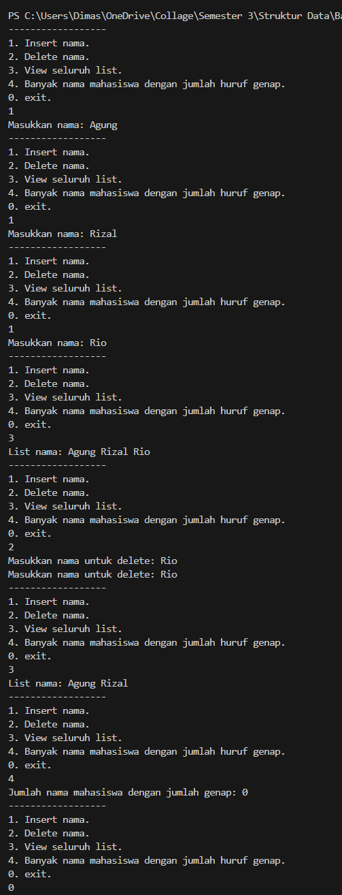

Asessment Praktikum Struktur Data

-Nama: Dimas Ramadhani
-NIM: 103112400065
-Kelas: IF-12-05
-Soal: Nomor 1 (NIM Ganjil)

1. Kode Program

Berikut adalah kode program (singly linked list) untuk memasukkan, menghapus berdasarkan nama, menghitung jumlah nama genap dan menampilkan seluruh list.

```C++
 /*
    * Author: Dimas Ramadhani
    * NIM: 103112400065
    * Deskripsi: kode program untuk memasukkan, menghapus berdasarkan nama, menghitung jumlah nama genap dan menampilkan seluruh list.
*/

#include <iostream>
#include <string>
#define Nil NULL
using namespace std;

typedef string infotype;
typedef struct elmlist *address;

struct elmlist {
    infotype info;
    address next;
};

struct list {
    address first;
};

void createList (list &L){
    L.first = Nil;
}

address createNode (infotype x) {
    address P = new elmlist;
    P->info = x;
    P->next = Nil;
    return P;
}

void insertLast (list &L, infotype x) {
    address dimas = createNode(x); 
    if (L.first == Nil) L.first = dimas; 
    else {
        address P = L.first;
        while (P->next != Nil) {
            P = P->next;
        }
        P->next = dimas;
    }
}

void deleteFirst(list &L) {
    address P = L.first;
    L.first = Nil;
    delete P;
}

void deleteAntara(list &L, address elemenHapus, address elemenPatokan) {
    elemenPatokan->next = elemenHapus->next;
    elemenHapus->next = Nil;
    delete elemenHapus;
}

void deleteByName (list &L, infotype x) {
    if (L.first == Nil) {
        cout << "Data kosong!. Tidak dapat menghapus.";
    } else {
        address target = L.first;
        address prev;
        bool ada;
        while (target != Nil && target->info != x) {
            prev = target;
            target = target->next;
            if (target->info == x) ada = true;
        }

        if (!ada) {
            cout << "Nama " << x << " tidak ditemukan.\n";    
        } else {
            if (target == L.first) deleteFirst(L);
            else deleteAntara(L, target, prev);
        }

    }
}

void viewList(list &L) {
    if (L.first == Nil) cout << "List kosong!.";
    else {
        address P = L.first;
        cout << "List nama: ";
        while (P != Nil) {
            cout << P->info << " ";
            P = P->next;
        }
    }
    cout << endl;
}

void hitungNamaGenap(list &L) {
    address ramadhani = L.first;
    int nama;
    int jumlahNama = 0;
    while (ramadhani != Nil) {    
        if (ramadhani->info.length()%2 == 0) {
            cout << ramadhani->info  << " ";
            jumlahNama = jumlahNama + 1;
        }
        ramadhani = ramadhani->next;
    }
    cout << "Jumlah nama mahasiswa dengan jumlah genap: " << jumlahNama;
    cout << endl;
}

int main () {
    list L;
    infotype inputNama;
    int inputMenu;
    createList(L);

    do {
        cout << "------------------\n";
        cout << "1. Insert nama.\n";
        cout << "2. Delete nama.\n";
        cout << "3. View seluruh list.\n";
        cout << "4. Banyak nama mahasiswa dengan jumlah huruf genap.\n";
        cout << "0. exit.\n";
        cin >> inputMenu;
        switch (inputMenu)
        {
        case 0:
            break;
        case 1: // insertLast (Insert nama akhir list)
            cout << "Masukkan nama: ";
            cin >> inputNama;
            insertLast(L, inputNama);
            break;
        case 2: // delete spesifik (Delete nama pertama ditemukan)
            cout << "Masukkan nama untuk delete: ";
            cin >> inputNama;
            deleteByName(L, inputNama);
            break;
        case 3: // view seluruh list
            viewList(L);
            break;
        case 4:
            hitungNamaGenap(L);
            break;
        default:
            cout << "Input tidak valid!\n";
            break;
        }
    } while (inputMenu != 0);
    return 0;
}
```

2. Penjelasan Kode

Berikut adalah penjelasan alur logika dari kode program di atas:

**Header & namespace**
Program ini mengimport library iostream untuk melakukan input (`cin`) dan output (`cout`), dan mengimport `string` untuk menggunakan lenght yang berguna menghitung jumlah huruf pada suatu string. Program ini mendifinisikan variabel `Nil` adalah `NULL`. Lalu program ini juga menggunakan `namspace` yang berguna untuk memudahkan dalam penulisah `std`.

**ADT (Abstract Data Type)**
Mmebuat tipe data baru seperti tipe data `infotype` sebagai alias dari string, selain itu ada tipe data `address` sebagai alias dari pointer yang menunjuk node elmlist.
Membuat struktur bernama elmlist, yang memiliki variabel `info` bertipe `infotype` dan `next` bertipe `address`. Selain itu membuat struktur baru lai yaitu `list` berisi `first` bertipe address yang berfungsi sebagai penunjuk elemen pertama.

**Prosedur createList**
Prosedur ini untuk membuat list baru.

**Fungsi createNode**
Fungsi ini untuk membuat node baru dengan parameter x bertupe infotype.

**Prosedur insertLast**
Prosedur ini berguna untuk menyisipkan elemen baru ke paling akhir dari list.

**Prosedur deleteFirst**
Prosedur ini berguna untuk menghapus elemen pertama atau paling depan dalan list.

**Prosedur deleteAntara**
Prosedur ini berguna untuk menghapus elemen yang berada diantara elemen lain.

**Prosedur deleteByName**
Prosedur ini berguna unutk menghapus elemen sesuai dengan nama pertama yang dicari.

**Prosedur viewList**
Prosedur ini berguna untuk melihat semua elemen yang ada dalam list.

**Prosedur hitungNamaGenap**
Prosedur ini berguna untuk melihat berapa banyak nama yang jumlah hurufnya genap dan menampilkan nama itu.

**Fungsi main**
Fungsi ini berguna sebagai kumpulan atau pemanggilan fungsi dan prosedur.

3. Output Program

Berikut adalah hasil eksekusi program (output) ketika dijalankan.


4. Penjelasan Lanjutan (Analisis Output)

Sesuai permintaan Anda ("Penjelasan Lagi"), bagian ini menganalisis mengapa output yang dihasilkan sudah benar:

pada output 1, 2, dan 3: user memilih angka 1 (insert nama), lalu memasukkan nama yang ingin di input.
pada output 5: user memilih angka 2 (delete nama spesifik).
pada output 4 dan 6: user memilik angka 3 (melihat seluruh elemen).
pada output 7: user memilih angka 4 (menghitung berapa orang yang namanya genap). menggunakan fungsi lenght lalu di moduluskna dengan 2 jika sama dengan 0 maka dapat menambah jumlah orangnya.

5. Kesimpulan

Berdasarkan implementasi dan pengujian kode di atas, dapat disimpulkan bahwa:

Konsep percabangan (selection) menggunakan if-else sangat fundamental untuk membuat program yang dapat mengambil keputusan berdasarkan kondisi tertentu.

Operator Aritmetika Modulus (%) adalah alat yang efektif untuk menentukan keterbagian, yang dalam kasus ini digunakan menghitung berappa banyak orang yang memiliki nama genap

Program telah berhasil memenuhi spesifikasi tugas, yaitu menerima input dari user dan memberikan output yang benar sesuai dengan status ganjil/genap dari input tersebut.
